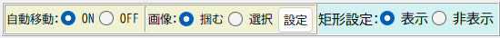
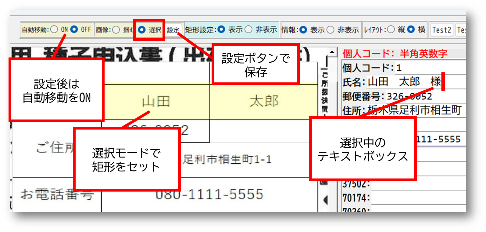

# 黄色矩形の設定

矩形設定用のUIとキーボードショートカットの説明 
テキストボックスごとに画像に黄色い矩形を設定してフォーカス時はそこに移動する

---

## 使用条件

矩形操作は以下の条件が必要:
- 矩形設定が**選択モード**であること
- 矩形設定が**掴みモード**でないこと

---

## 黄色い矩形の設定

### 矩形設定 表示
- 矩形に関する設定UIを表示するかどうかを

### 自動移動
- ON: テキストボックス移動時、設定した矩形が中心に来るように移動する
- OFF: 自動移動を使用しない

### 画像 掴む
画像左クリック時の挙動
- 掴む：画像を掴んで移動するモード
- 選択：ドラッグで矩形を設定するモード

### 設定ボタン
- 現在フォーカス中のフィールドに矩形を設定
- 画面上で黄色い矩形をセットした状態で実行
- 設定後、次のフィールドに自動移動

---

## ショートカットキー

### Ctrl+R - 矩形設定
- 上記設定ボタンと同じ処理

### Ctrl+Shift+R - 前のデータから矩形コピー
- 1つ前（上）のデータの矩形設定を現在のフィールドにコピー
- 同じ位置のフィールドを少量設定する際に便利
- 設定後、次のフィールドに自動移動

### Ctrl+Alt+R - 空欄を前のデータで一括埋め
- 未設定の矩形を直前の有効な矩形で一括埋め
- 同じ位置のフィールドを大量設定する際に便利

### Ctrl+Shift+Alt+R - 全矩形データをリセット
- すべての矩形設定を削除
---

## 設定画面

